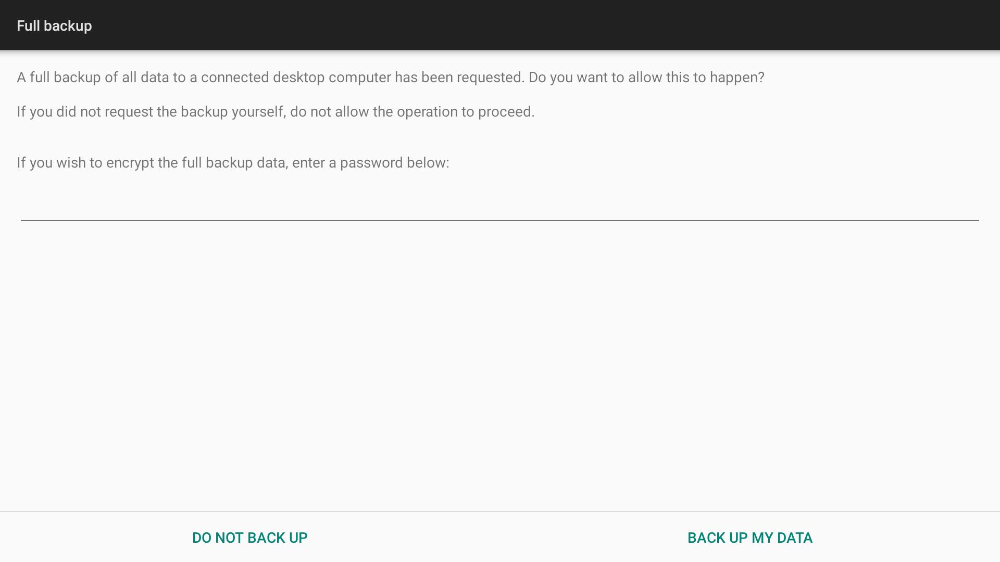

# SmartTube PlayNext Exporter

Export Android TV Watch Next records for the current and legacy SmartTube package IDs into JSON and CSV files. This is a local, one-time export. It does not use a phone, modify SmartTube, or run a sync service.

## Screenshots

The first image shows the Google TV Play next row. Recommendation artwork is blurred to avoid publishing personal viewing history.


This is the Android full-backup confirmation prompt shown on the TV when ADB requests a provider backup. A restore request may show a separate confirmation prompt, depending on the Android build.



## Required tools

- Android SDK Platform-Tools, with ADB available on the computer. ADB is required to connect to the TV and capture its provider backup.
- Python 3.10 or newer. The exporter uses only Python's standard library, with no pip packages.
- An Android TV device that allows ADB access and provider backup.

The workflow has been exercised with an Android 9 TV. ADB backup support varies by device and Android version.

## 1. Install ADB

Download Platform-Tools from the [official Android developer site](https://developer.android.com/tools/releases/platform-tools), extract it, and add its platform-tools folder to your PATH.

Check that ADB is available:

```sh
adb version
```

If ADB is not on PATH, pass its full location with the --adb option in step 4.

## 2. Enable debugging on the TV

TV menu names vary by manufacturer.

1. Open Settings, then About or System.
2. Highlight the Android TV OS build or Build entry and press Select seven times to enable Developer options.
3. Return to Settings, open Developer options, and enable ADB debugging or USB debugging.
4. If the TV offers Wireless debugging, enable it and follow the pairing instructions shown on the TV.
5. Find the TV IP address in its network settings. Keep the computer and TV on the same local network.

## 3. Connect and authorize the computer

For TVs that expose classic network ADB, replace TV_IP with the address shown in network settings:

```sh
adb connect TV_IP:5555
adb devices -l
```

Approve the debugging prompt on the TV if it appears. Use the device serial shown by adb devices -l in step 4.

For Wireless debugging with pairing, use the pairing address and port shown on the TV, then connect to its separate connection address and port:

```sh
adb pair TV_IP:PAIRING_PORT
adb connect TV_IP:CONNECTION_PORT
adb devices -l
```

## 4. Capture and export

Run the command with the connected device serial:

```sh
python3 capture_watch_next.py --device TV_IP:5555 --output-dir exports
```

When Android displays the Backup my data prompt on the TV, approve it. The computer waits for the backup to finish, then creates separate JSON and CSV files for both SmartTube package IDs.

To select ADB by full path, add --adb /path/to/platform-tools/adb.

The capture requests a backup of com.android.providers.tv and reads its watch_next_programs table. It exports all matching rows, including rows marked browsable=0.

The parser supports unencrypted Android backup files. If the TV requests a backup password, leave it unset for this exporter.

## Exported packages

The exporter keeps these package IDs separate because both can appear as SmartTube in the TV interface:

- org.smarttube.stable, the current package ID
- com.teamsmart.videomanager.tv, the legacy package ID

The manifest records the source archive hash, database checks, and row counts. It omits the TV IP address and local absolute file paths.

## Local data and privacy

The exports/ directory contains the raw Android backup and viewing records. It is excluded by .gitignore. Keep these files private and do not commit or upload them.

## Remove all Watch Next data

The optional clear workflow prepares a new provider backup with every row removed from `watch_next_programs`, then restores that snapshot to the TV. This table is shared by apps, so this clears Watch Next items from all apps, not only SmartTube. Apps may add new items again later.

Restoring replaces the TV provider's data with the snapshot made by this workflow. Changes made to that provider after the snapshot may be overwritten. Keep the original backup until you have verified the result. The workflow refuses to overwrite existing output files and requires a typed confirmation before restore.

ADB backup support varies by device and Android version. This workflow was exercised on one Android 9 TV. On Android 12 and later, `adb backup` restricts app data for apps targeting Android 12 or later, so the TV provider database may not be included. The script stops if it cannot find and validate the database. See the [Android 12 backup behavior changes](https://developer.android.com/about/versions/12/behavior-changes-12#adb-backup-restrictions).

### 1. Prepare a fresh cleared backup

Connect and authorize the TV as described above, then run:

```sh
python3 clear_watch_next.py prepare --device TV_IP:5555
```

Approve the full backup request on the TV. The script saves these files under `exports/clear-watch-next/`:

- `com.android.providers.tv.original.ab`, the fresh source backup for recovery
- `com.android.providers.tv.watch-next-cleared.ab`, the prepared restore backup
- `watch-next-clear-manifest.json`, row counts and validation hashes

The script validates the SQLite database before and after the edit, confirms that no Watch Next rows remain in the prepared backup, and checks that row counts in the other database tables did not change. It updates only the `watch_next_programs` table in the backup.

### 2. Restore the prepared backup

Review the manifest, then run:

```sh
python3 clear_watch_next.py restore \
  --device TV_IP:5555 \
  --backup exports/clear-watch-next/com.android.providers.tv.watch-next-cleared.ab \
  --manifest exports/clear-watch-next/watch-next-clear-manifest.json
```

Type `RESTORE com.android.providers.tv` when asked, then approve the restore on the TV if prompted. To restore the original snapshot instead, run the command below and approve it on the TV. This also replaces the current provider data with the earlier snapshot.

```sh
adb -s TV_IP:5555 restore exports/clear-watch-next/com.android.providers.tv.original.ab
```

### 3. Verify the TV

Run a new provider backup immediately after restore:

```sh
python3 clear_watch_next.py verify --device TV_IP:5555
```

Approve the backup on the TV. A successful verification reports zero rows in `watch_next_programs` and an `ok` SQLite integrity check. The verification backup and report are saved locally under `exports/clear-watch-next/` and remain excluded from Git.

## SmartTube attribution

SmartTube is an open-source Android TV application by [yuliskov](https://github.com/yuliskov/smarttube). This exporter is an independent utility that reads Android TV Watch Next records associated with SmartTube package IDs. It is not affiliated with or endorsed by the SmartTube project.

## License

This exporter is released under the MIT License. SmartTube is separate software with its own license and copyright notices.
